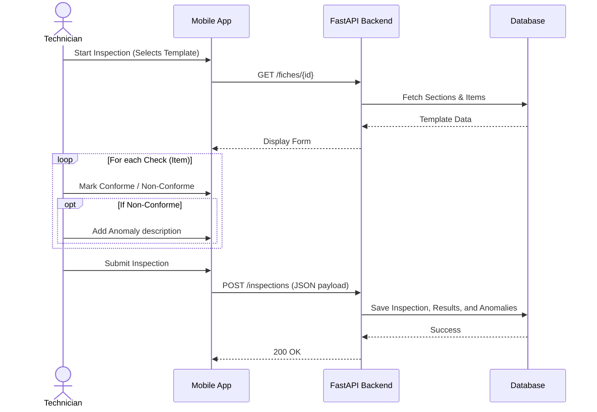
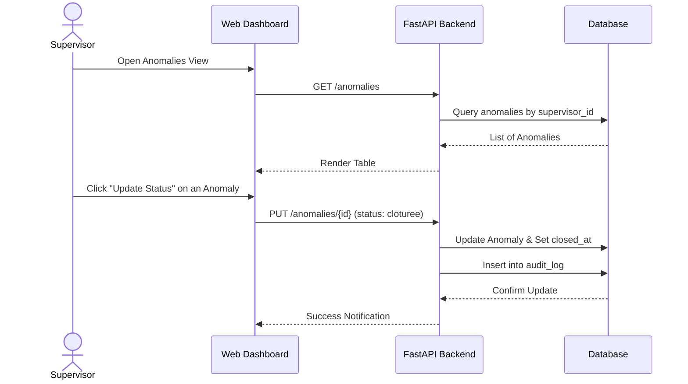

# Kofert - How It Works

## 1. Introduction
Kofert is a comprehensive digital inspection and compliance management system designed to streamline the process of conducting equipment inspections, reporting anomalies, and tracking them until resolution. It bridges the gap between field workers (Technicians) and management (Supervisors) by providing a mobile app for on-site data entry and a web dashboard for oversight.

## 2. Technology Stack
The project is built using a modern full-stack architecture divided into three main directories:

### Backend (`kofert-app/backend/`)
* **Framework:** FastAPI (Python)
* **Database ORM:** SQLAlchemy
* **Database Migration:** Alembic
* **Database:** SQLite (local development `kofert.db`)
* **Key Files:** 
  * `app/main.py`: Entry point for the FastAPI application.
  * `app/models/`: Contains all SQLAlchemy database models.
  * `app/routers/`: API endpoints grouped by feature (e.g., users, inspections).

### Web Frontend (`kofert-app/frontend/`)
* **Framework:** React 19 + Vite
* **Routing:** React Router DOM
* **Styling:** Tailwind CSS + PostCSS
* **UI Utilities:** Framer Motion (animations), Lucide React (icons)
* **HTTP Client:** Axios
* **Purpose:** Supervisor dashboard for managing equipments, templates, viewing inspection reports, and tracking anomalies.

### Mobile App (`kofert-app/mobile/`)
* **Framework:** React Native + Expo (v54)
* **Navigation:** React Navigation (Stack & Bottom Tabs)
* **UI Components:** React Native Calendars, Picker, Vector Icons
* **Data Fetching:** Axios + NetInfo (for network state) + Async Storage (offline/token storage)
* **Purpose:** Field application for Technicians to view schedules, execute inspections, and report anomalies.

---

## 3. Core Concepts & Data Models
The system revolves around several key entities defined in `app/models/`:

* **User (`user.py`):** Can be a `technicien`, `superviseur`, or `admin`.
* **Equipement (`equipement.py`):** The physical assets being inspected. Assigned to a specific supervisor.
* **FicheTemplate (`fiche.py`), Section (`section.py`), Item (`item.py`):** The structure of an inspection checklist. A Fiche (Template) contains Sections, which contain Items (questions/checks).
* **Inspection (`inspection.py`):** An instance of a FicheTemplate filled out by a Technician on a specific date. It has a status (`brouillon` or `soumise`).
* **Resultat (`resultat.py`):** The answer to a specific Item (`conforme` or `non_conforme`), potentially linked to a numeric value (`MesureValeur`).
* **Anomalie (`anomalie.py`):** Created when an item is marked as non-compliant. Follows a lifecycle (`ouverte`, `en_cours`, `cloturee`).

---

## 4. Real-World Scenarios

### Scenario 1: Conducting a Field Inspection (Technician)
1. **Login:** The Technician logs into the Expo mobile app. The app stores the JWT token in `AsyncStorage`.
2. **Planning:** They open the Calendar view to see scheduled inspections for the day.
3. **Execution:** They select an equipment and start a new inspection based on the assigned `FicheTemplate`.
4. **Data Entry:** For each `Item`, they toggle "Conforme" or "Non-conforme". If numerical measurements are required (`ItemTypeEnum.numerique`), an input field appears.
5. **Anomaly Reporting:** If an item is "Non-conforme", they are prompted to leave a remark or description, which automatically flags an `Anomalie`.
6. **Submission:** The inspection is submitted via `POST /inspections`. 



### Scenario 2: Managing Anomalies (Supervisor)
1. **Dashboard Overview:** The Supervisor logs into the React web frontend. The dashboard calls `GET /inspections` and `GET /anomalies` to show real-time stats for their assigned equipments.
2. **Anomaly Triage:** They navigate to the Anomalies page. They see a list of all `ouverte` (open) anomalies reported by technicians.
3. **Action & Assignment:** They open an anomaly modal (managed in `AnomaliesPage.jsx`), read the technician's remark, and assign it to a repair team or change its status to `en_cours`.
4. **Resolution:** Once fixed physically, the supervisor updates the status to `cloturee` (closed). The backend records this action in the `AuditLog`.



---

## 5. System Architecture & Data Flow

Below is a high-level Use Case diagram illustrating how different actors interact with the entire Kofert ecosystem.

```mermaid
flowchart LR
    %% Actors
    T[👤 Technician<br>(Mobile App)]
    S[👤 Supervisor<br>(Web Dashboard)]
    A[👤 Admin<br>(Web Dashboard)]

    %% System
    subgraph Kofert Ecosystem
        direction TB
        
        %% Mobile Flow
        M_Auth([Login & Profile])
        M_Insp([Perform Inspections])
        M_Hist([View History])
        
        %% Web Flow
        W_Eq([Manage Equipments])
        W_Tpl([Manage Templates/Fiches])
        W_Dash([Monitor Dashboard])
        W_Anom([Resolve Anomalies])
        W_Usr([Manage Users & Roles])
    end

    %% Tech Links
    T --> M_Auth
    T --> M_Insp
    T --> M_Hist

    %% Sup Links
    S --> M_Auth
    S --> W_Eq
    S --> W_Tpl
    S --> W_Dash
    S --> W_Anom

    %% Admin Links
    A --> M_Auth
    A --> W_Usr
```

---

## 6. Project Directory Guide
* **`kofert-app/backend/alembic/`**: Database migration scripts. Run `alembic upgrade head` to apply changes.
* **`kofert-app/backend/seed_data.py`**: A vital script for populating the local database with initial mock data (Admin user, demo equipments, templates) to facilitate development.
* **`kofert-app/frontend/src/`**: React source code.
  * `pages/`: Full-screen views (e.g., `Dashboard.jsx`, `AnomaliesPage.jsx`).
  * `components/`: Reusable UI elements (cards, modals).
* **`kofert-app/mobile/src/`**: Expo React Native source code.
  * `screens/`: App screens (e.g., `LoginScreen.js`, `InspectionScreen.js`).
  * `navigation/`: Stack and Tab navigators definition.

---
**Summary:** Kofert provides an end-to-end loop. A Supervisor uses the **Web App** to define *what* needs checking (Fiche Templates). The Technician uses the **Mobile App** to perform the check on the field. If something is broken, an Anomaly is created. The Supervisor uses the **Web App** to track and close that Anomaly.
